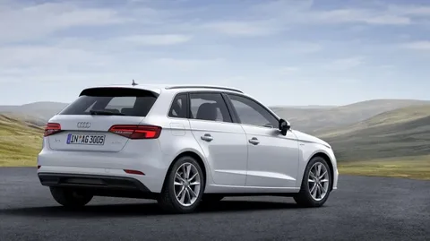
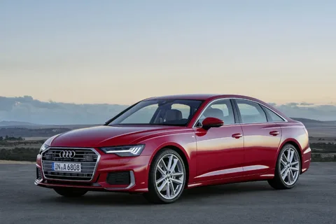
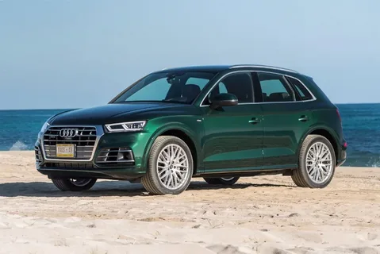

<!DOCTYPE html>
<html lang="ru">
<head>
  <title>Характеристика автомобилей Audi</title>
</head>
<body>

Здесь вы можете воспользоваться навигациейпо сайту:

<nav>
    <a href="#a3"> Audi A3</a>
    <a href="#a6"> Audi A6</a>
    <a href="#q5"> Audi Q5</a>
</nav>

    
    
 <h1><em>Характеристика автомобилей Audi</em>  </h1>

    

    <section id="a3">
        <h2>Характеристика первого авто: </h2>
<table align="center" "bgcolor="#D8BFD8" border="2" cellpadding="5" cellspacing="0" bordercolor="#000000">
 <caption><b>Audi A3 Sportback 🚗</b></caption>
 <tbody>
    <tr>
        <td>Тип двигателя</td>
        <td>Бензиновый (также доступны дизельные и гибридные версии)</td>
    </tr>
    <tr>
        <td>Расход топлива</td>
        <td>~5.5 л/100 км</td>
    </tr>
    <tr>
        <td>Тип машины</td>
        <td>Роботизированная (S tronic)</td>
    </tr>
    <tr>
        <td>Количество передач</td>
        <td>7</td>
    </tr>
    <tr>
        <td>Габариты (длина, ширина, высота)</td>
        <td>4343 мм × 1816 мм × 1449 мм</td>
    </tr>
    <tr>
        <td>Объем багажника</td>
        <td>380 л (до 1200 л со сложенными сиденьями)</td>
    </tr>
    <tr>
        <td>Наличие систем активной и пассивной безопасности</td>
        <td>
            

                
Показать детали

                ABS, ESP, до 6 подушек безопасности
                
ABS — это система, которая предотвращает блокировку колес при резком торможении или на скользкой дороге.

                 ESP — это более сложная система, которая помогает предотвратить занос и потеру контроля над автомобилем. По сути, она использует ABS как один из своих инструментов.
            
 

        </td>
    </tr>
    <tr>
        <td>Рейтинг краш-тестов</td>
        <td>★★★★★ (5/5)</td>
    </tr>
    <tr>
        <td>Разгон до 100 км/ч</td>
        <td>8.4 сек</td>
    </tr>
    <tr>
        <td>Максимальная скорость</td>
        <td>224 км/ч</td>
    </tr>
    <tr>
        <td>Начальная цена модели</td>
        <td>от 3 100 000 ₽</td>
    </tr>
    <tr>
        <td>Наличие Wi-Fi и Bluetooth</td>
        <td>Bluetooth есть, Wi-Fi как опция</td>
    </tr>
    <tr>
        <td>Тормозная система</td>
        <td>Дисковые тормоза</td>
    </tr>
 </tbody>
 

</table>

<figure>
  
  <figcaption>Фото автомобиля: Audi A3 Sportback 🚗</figcaption>
</figure>
 <aside>
<strong>Интересный факт:</strong> Audi A3 впервые была представлена в 1996 году и стала одной из первых моделей на платформе Volkswagen Golf.
</aside>
</section>
 

 <section id="a6">
     <h2>Характеристика второго авто: </h2>
<table align="center" "bgcolor="#D8BFD8" border="2" cellpadding="5" cellspacing="0" bordercolor="#000000">
 <caption><b>Audi A6 Sedan 🏎</b></caption>
 <tbody>
    <tr>
        <td>Тип двигателя</td>
        <td>Бензиновый / Дизельный / Гибридный (мягкий гибрид)</td>
    </tr>
    <tr>
        <td>Расход топлива</td>
        <td>~7.0 л/100 км (бензин)</td>
    </tr>
    <tr>
        <td>Тип машины</td>
        <td>Роботизированная (S tronic)</td>
    </tr>
    <tr>
        <td>Количество передач</td>
        <td>7</td>
    </tr>
    <tr>
        <td>Габариты (длина, ширина, высота)</td>
        <td>4939 мм × 1886 мм × 1457 мм</td>
    </tr>
    <tr>
        <td>Объем багажника</td>
        <td>530 л</td>
    </tr>
    <tr>
        <td>Наличие систем активной и пассивной безопасности</td>
        <td>ABS, ESP, 8 подушек безопасности</td>
    </tr>
    <tr>
        <td>Рейтинг краш-тестов</td>
        <td>★★★★★ (5/5)</td>
    </tr>
    <tr>
        <td>Разгон до 100 км/ч</td>
        <td>5.1 сек (в версии 55 TFSI quattro)</td>
    </tr>
    <tr>
        <td>Максимальная скорость</td>
        <td>250 км/ч</td>
    </tr>
    <tr>
        <td>Начальная цена модели</td>
        <td>от 5 900 000 ₽</td>
    </tr>
    <tr>
        <td>Наличие Wi-Fi и Bluetooth</td>
        <td>Оба доступны</td>
    </tr>
    <tr>
        <td>Тормозная система</td>
        <td>Вентилируемые дисковые тормоза</td>
    </tr>
 </tbody>
</table>

<figure>
  
  <figcaption>Фото автомобиля: Audi A6 Sedan 🏎</figcaption>
</figure>
</section>

<section id="q5">
     <h2>Характеристика третьего авто: </h2>
<table align="center" "bgcolor="#D8BFD8" border="2" cellpadding="5" cellspacing="0" bordercolor="#000000">
 <caption><b>Audi Q5 🚙</b></caption>
 <tbody>
    <tr>
        <td>Тип двигателя</td>
        <td>Дизельный / Гибридный (в зависимости от комплектации)</td>
    </tr>
    <tr>
        <td>Расход топлива</td>
        <td>~6.5 л/100 км (дизель), ~2.0 л/100 км (гибрид)</td>
    </tr>
    <tr>
        <td>Тип машины</td>
        <td>Роботизированная (S tronic)</td>
    </tr>
    <tr>
        <td>Количество передач</td>
        <td>7</td>
    </tr>
    <tr>
        <td>Габариты (длина, ширина, высота)</td>
        <td>4682 мм × 1893 мм × 1662 мм</td>
    </tr>
    <tr>
        <td>Объем багажника</td>
        <td>550 л (до 1550 л со сложенными сиденьями)</td>
    </tr>
    <tr>
        <td>Наличие систем активной и пассивной безопасности</td>
        <td>ABS, ESP, 6–8 подушек безопасности</td>   
    </tr>
    <tr>
        <td>Рейтинг краш-тестов</td>
        <td>★★★★★ (5/5)</td>
    </tr>
    <tr>
        <td>Разгон до 100 км/ч</td>
        <td>6.1 сек</td>
    </tr>
    <tr>
        <td>Максимальная скорость</td>
        <td>237 км/ч</td>
    </tr>
    <tr>
        <td>Начальная цена модели</td>
        <td>от 5 000 000 ₽</td>
    </tr>
    <tr>
        <td>Наличие Wi-Fi и Bluetooth</td>
        <td>Оба доступны</td>
    </tr>
    <tr>
        <td>Тормозная система</td>
        <td>Дисковые тормоза</td>
    </tr>
 </tbody>
</table>

<figure>
  
  <figcaption>Фото автомобиля: Audi Q5 🚙</figcaption>
</figure>

</section>

<blockquote>
    
"Audi — это не просто автомобиль, это инженерное искусство на колесах"

    <cite>— Фердинанд Пих, бывший председатель совета директоров Volkswagen Group</cite>
</blockquote>

<h3><b><em>Далее вы можете наблюдать сравнительную таблицу авто по нескольним критериям</em></b></h3>

<table border="1" cellpadding="8" style="width: 100%; border-collapse: collapse;">
    <colgroup>
        <col style="background-color: #d1e7ee; width: 30%;">
        <col style="background-color: #daf4da; width: 30%;">
        <col style="background-color: #ebdac6; width: 40%;">
    </colgroup>
    <thead>
        <tr>
            <th>Критерий</th>
            <th>A3 Sportback</th>
            <th>A6 Sedan</th>
        </tr>
    </thead>
    <tbody>
        <tr>
            <td>Цена</td>
            <td>3.1 млн ₽</td>
            <td>5.9 млн ₽</td>
        </tr>
        <tr>
            <td>Разгон 0-100 км/ч</td>
            <td>8.4 сек</td>
            <td>5.1 сек</td>
        </tr>
        <tr>
            <td>Расход топлива</td>
            <td>5.5 л/100км</td>
            <td>7.0 л/100км</td>
        </tr>
        <tr>
            <td>Объем багажника</td>
            <td>380 л</td>
            <td>530 л</td>
        </tr>
    </tbody>
</table>
</body>

